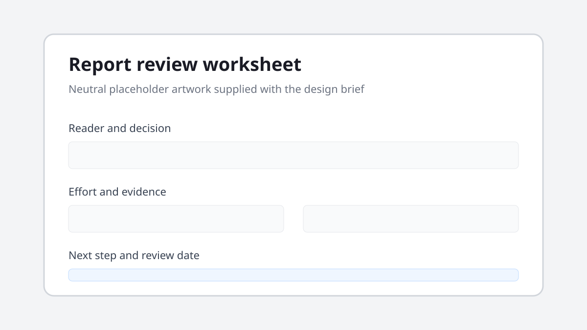

# Deciding when to retire a weekly report

*Operations note · 18 September 2026 · Reading time: 7 minutes*

A recurring report should earn the time spent producing and reading it. This note proposes a simple review: keep reports that still change a decision, revise those with a useful signal but poor framing, and retire those that merely document motion.

> A report is not valuable because it is complete. It is valuable when someone can name the decision it improves.

## Start with the reader's decision

Ask one person who receives the report: **what do you do differently after reading it?** Useful answers are concrete, such as adjusting staffing, investigating a failed check, or changing a delivery date.

Three weaker answers deserve follow-up:

- “It keeps everyone informed.” Who acts on the information?
- “We have always sent it.” What risk would stopping create?
- “The data might be useful later.” Could the source remain available on demand?

See the [review worksheet](../assets/report-review-worksheet.svg) for a neutral conversation aid.

## Measure effort and evidence

Record one ordinary month rather than estimating from memory.

| Signal | Current | Healthy range | Interpretation |
|---|---:|---:|---|
| Preparation time | 3.5 h/week | Under 2 h/week | Too much manual assembly |
| Regular readers | 14 | 10 or more | Audience is real |
| Decisions cited | 1/month | 2 or more/month | Weak link to action |
| Data corrections | 3/month | Under 1/month | Source quality needs work |

An inventory can begin as a small text file:

```yaml
report: weekly-service-review
owner: operations
cadence: weekly
decision: "whether to change the next support rota"
review_on: 2026-10-30
```

### Check the awkward cases

A compliance record may be necessary even when few people read it. A safety report may be valuable because it confirms that nothing happened. Label those purposes plainly instead of forcing every document into the same engagement metric.

## Choose one next step

1. **Keep** it when the decision and audience are clear.
2. **Revise** it when the signal matters but the format hides it.
3. **Retire** it when no owner can name a current use.

For a revision, test one smaller version for four weeks. Put the decision at the top, link to detail, and remove any field that has no named reader. Review the result on the agreed date rather than allowing the experiment to become permanent by accident.

## Record the outcome

Write down the owner, decision, review date, and where the underlying data remains available. This gives future readers a better answer than a silent disappearance, and makes reinstating a genuinely useful report straightforward.


